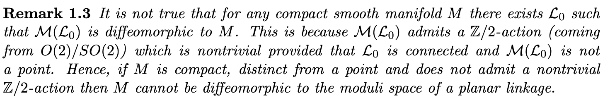
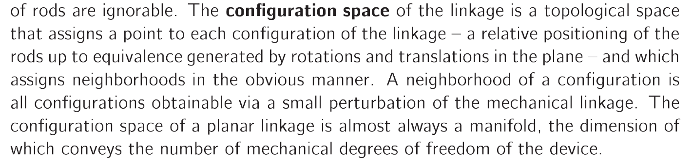
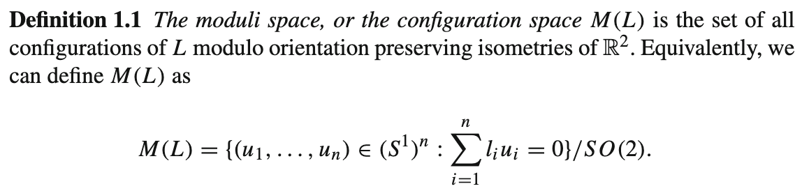

## Current Talking Points

- __Exploring the Configuration Space of the 5-gon__
    Kevin Walker talks about how you can supposedly derive all of the orientable 2-manifolds from genus zero to four, looking at the configuration space of a $C_5$ with different length functions.

    However, he does this from a diagram I can't claim to understand yet.

    I think the roots of this come from something called a fibered product, as well as an idea that if you add a link of a small enough length to something you can gain a Cartesian product with an $\mathbb S^1$ in your configuration space.

- __Discussing my Approach to Finding Homotopies__
I decided to work through finding a homotopy between the rectangle linkage and the manifold composed of two $\mathbb S^1$'s, disjoint besides two antipodal points. 
    
    This was a little fiddly but the main issue is that it looks super messy and is hard to understand, even though the intuition as to why it works feels simple.
    
    I was wondering if maybe in the 'final product' I should go through some trivial homotopies like the n-arms and leave the more complicated stuff to be explained in words?
    
- __Understanding the Importance of Nash Isomorphisms__
    I had a look at what I could find out about Nash Isomorphisms, and I managed to find a definition of a Nash function, and _I think_ I've got an idea of what a Nash manifold is. Then I found a theorum about how all 

## Looked At This Week

-   Demonstrated the existence of a homotopy between the configuration space of a rectangle and a manifold composed of two circles intersecting at two points.
-   Programmed the structure needed for threejs rendering, a webpage using threejs and orbit controls, as well as a script for defining the objects to render
-   Defined `Manifold`, `CirclesTwoIntersections`, `Linkage` and  `Polygon` classes. `CirclesTwoIntersections` is  fully functional and looking pretty:
    
    However `Polygon` still needs a little work:
    (meant to be a 2x1 rectangle)
-   Defined a standard way to specify the configuration of a manifold.
-   Found and understood the Classification of 2-Manifolds. As well as finding an example of a linkage that provides as a configuration space the orientable manifolds of genus 0 through 3 in Kevin Walkers paper, however I don't fully understand this yet. Somehow it's meant to pop out of this diagram?
    

## Current Problems

- Understanding the Kevin Walker pg 20 on the 5-gon linkage leading to orientable 2-manifolds with genus 0 through 3.
- Nash Isomorphisms seem difficult to grapple, and I can't find much online about them.

## Current Tasks

-   Work through the homotopies for the 'arm' class of linkages
-   Fix my linkage renderer
-   Add angle helper class

## Links

Kapovich and Millson 
https://arxiv.org/pdf/math/9803150.pdf

Robert Ghrist
https://www.math.upenn.edu/~ghrist/EAT/EATchapter1.pdf

Gaiane Panina
http://amj.math.stonybrook.edu/pdf-Springer-final/017-0070.pdf

Kevin Walker
https://canyon23.net/math/1985thesis.pdf

"On the Conjecture of Kevin Walker" ==unread==
https://arxiv.org/pdf/0708.2995.pdf

Some Lecture Notes from a Course on this, talks about chambers in a way that sounds good ==unread== 
http://homepages.warwick.ac.uk/~maskas/courses/schuetz1.pdf

## Project Notes

##### _Describing the Homotopy between the 1-arm, 2-arm and n-arm and the $\mathbb T^n $==work in progress==_

##### _Describing the Homotopy between a $(C_4, (a,b,a,b))$ and the Intersecting $\mathbb S^1$'s_

I believe this holds for all $(C_4, (a,b,a,b))$ with $a,b \in \mathbb R^+$ and $a \not = b$. 

This provides an interesting configuration space $M((C_4, (a,b,a,b)))$, which we'll shorten to $M$ for this exercise, that is composed of a two $\mathbb S^1$'s which are disjoint besides two points (call this manifold $X$ for now). This looks like so:

To prove this we have to find a pair of maps:
$$
f: M \rarr X \\
g: X \rarr M \\
s.t. f \, \circ g \simeq Id_X \, and \, g \, \circ f \simeq Id_{M}
$$
This is not too hard, using the definition of the Moduli Space that I have outlined, we can see that any position of the manifold can be indexed with two values, as we have 2 degrees of freedom. 

The first value is the angle subtended between $\hat e _y$ and the direction of the link connected to the base on the left. ==add a diagram here using `Polygon` with angle helpers==

The second value can be expressed with a Boolean, as we have a switch formed with the remaining two links, however, the two possible values are equivalent if the first value is $\frac \pi 2$ or $\frac {3 \pi} 2$. This happens because the first two links line up (==add diagram==) meaning that the angle between the 3rd and 4th link is either 0 or $\pi$ meaning that flipping it doesn't produce a new state.

Hence:

1.  Any point $(a_1,a_2)$ in $M((C_4, (2,1,2,1)))$ is also in $\mathbb S^1 \times \mathbb S^0$ but fixing $(0,1) = (0,0)$ and $(\pi,0) = (\pi, 1)$.
2.  Any point $\boldsymbol{x}$ in $X$ is on one of the $\mathbb{S^1}$'s that $X$ is composed of, at an angle we'll call $\theta$.

Without loss of generality, as the manifold is the same if you rotate it $\frac \pi 2$ about the $y$-axis, we can specify the $\mathbb S^1$'s  that make up $X$ and call them $B$ and $Y$ (blue and yellow matching the diagram).

Then define:
$$
f: M \rarr X \\
f := f((a_1,a_2)) =
\begin{cases}
\theta = a_1 \text{ around } Y \text{ if } a_2 = 0
\\
\theta = a_1 \text{ around } B \text{ if } a_2 = 1
\\
\theta = a_1 \text{ in } B \cap Y  \text{ if } a_1 = 0 \text{ or } a_1 = \pi \\
\end{cases}
$$
and:
$$
\\
g: X \rarr M \\
g := g(\boldsymbol{x}) = (a_1, a_2)  \\
\text{where } a_1 \text{ is } \theta \text{ and }  a_2 = 
\begin{cases}
0 \text{ if } \boldsymbol x \in Y
\\
1 \text{ if } \boldsymbol x \in B/Y
\end{cases}
$$
Now evaluating:
$$
(g \circ f)((a_1,a_2)) = g \left( \boldsymbol x := \begin{cases}
\theta = a_1 \text{ around } Y \text{ if } a_2 = 0
\\

\theta = a_1 \text{ around } B \text{ if } a_2 = 1\\
\theta = a_1 \text{ in } B \cap Y  \text{ if } a_1 = 0 \text{ or } a_1 = \pi \\
\end{cases} \right) 

= 

\left( \theta, 
\begin{cases}
0 \text{ if } \boldsymbol x \in Y
\\
1 \text{ if } \boldsymbol x \in B
\end{cases}
\right)

= (a_1, a_2)

\\

=> g \, \circ f \simeq Id_{M}
$$
and:
$$
(f \circ g)(\boldsymbol x) = f \left( \left(\theta, 
\begin{cases}
0 \text{ if } \boldsymbol x \in Y
\\
1 \text{ if } \boldsymbol x \in B/Y
\end{cases} \right) \right)
=
\boldsymbol x
\\
=> f \circ g \simeq Id_X
$$
Proving that $M \simeq X$. 

##### _Describing the homotopy between the switch and $\mathbb S^0 $ ==work in progress==_

##### _Definition and Intuition of Nash Isomorphisms_ 

A Nash function $f$ on a set $U$ satisfies there exists a polynomial $P$ in $x$ and $f(x)$ such that $\forall x \in U, \,\,\,\, P(x,f(x)) = 0$

A Nash Manifold is an example of a $U$ from the above definition that also has the structure of a manifold.

From Wikipedia, this result looks like it could be helpful:

>   "More generally, a smooth manifold admits a Nash manifold structure if  and only if it is diffeomorphic to the interior of some compact smooth manifold possibly with boundary."
>
>   https://en.wikipedia.org/wiki/Nash_functions

##### _Working with the 5-Cycle Linkage to get 2-Manifolds_ ==work in progress==

##### _The Classification Theorem for 2-Manifolds_

We can describe all 2-manifolds with a genus and an orientability. Probably write more and some drawings here if relevant, delete in a couple weeks if not going to be used.

##### _Current Working Definition of a Linkage, Configuration Space and the State of a Linkage_

A linkage is composed of a SCaF graph $L$ paired with a length function on the edges ($\ell$ ). 

A configuration or moduli space $C((L,\ell))$ is defined like so:
$$ M(L,\ell) := \{(\boldsymbol\alpha_1,..., \boldsymbol\alpha_n) \in (\mathbb S^1)^n | for \, any \, cycle \, l_i, ..., l_j\, in \, L: \sum_{k=i}^j \boldsymbol\alpha_k \ell_k = 0 \}$$
modulo distance preserving isometries of the plane.

When we work with a linkage we need a way to consistently talk about the position that the links are in. The way I will work with this is to consider the fixed link to be oriented in the x-axis and then measure the angle that each link makes to the y-axis clockwise, working with the links in chain from the left of the base. 

For now I am going to ignore forks, as they would require some more complex thought to decide how to work with their state.

If this is a polygon we will end up working round to the other side of the base link. Note that; unless the 3rd to last link ends up in the same position as the right of the base, we will be able to index the last two links using a single Boolean value as it will form a switch (two fixed points with two links between them).

If this is not a polygon then we have either an n-arm or nothing connected to both sides of the base link, and we can define these working with the left one, followed by the right one looking at the angles and working up through each arm in turn.

##### _Examples of Manifolds and the Linkages that Display them as Configuration Spaces_

$\mathbb S^1 $: A manifold  that leads to a $\mathbb S^1$ configuration space is easy to find, as it is the configuration space of a single linkage at the origin. 

$\mathbb S^2$?

$\mathbb S^1 \bigcup \, \mathbb S^1 = T^2$: A manifold with the configuration space two disjoint spheres is also pretty okay. This is the linkage represented by a pair of rigid links connected by a linkage that pivots freely around any angle.

##### _What Happens to the Configuration Space as one modifies the Linkage_ 

"Adding to the Chain"

When we add another link onto the end of a simple chain of length $n$ we go from a configuration space of $\bigcup_1^n \, \mathbb S^1 = T^n$ to one of $\bigcup_1^{n+1} \, \mathbb S^1 = T^{n+1}$, in fact, it seems that if we add another link to a system with a configuration space $M$ we will get a configuration space of $M \bigcup \mathbb \, S^1$.  (prove this?) 

##### _Is any Manifold Diffeomorphic to the Configuration Space of a well defined Linkage?_

Robert Ghrist states on page 12 of his book _Elementary Applied Topology_ that: 

https://www.math.upenn.edu/~ghrist/EAT/EATchapter1.pdf

However, Kapovich and Millson disagree with this in their paper below:

https://arxiv.org/pdf/math/9803150.pdf

At first glace I believe this is essentially telling us that not every manifold can be expressed as the configuration of some linkage as these configuration spaces can be transformed in some way (corresponding to moving the linkage in the plane in which it resides, like flipping it perhaps) and thus for any manifold that can't admit this transformation, it can't be diffeomorphic to a configuration space.

I think the best way to work out what is going on here is to work with the definitions of configuration space of a linkage, and decide if this relates to the differing theorem. It seems unlikely that Ghrist is stating his theorem more strongly without reason, given the cited source is Kapovich and Millson's paper.

##### _Robert Ghrist Defines a Configuration Space:_

Robert Ghrist defines a configuration space as follows (also page 12 of his book):

  

https://www.math.upenn.edu/~ghrist/EAT/EATchapter1.pdf

This has some points to take away, namely we **are** assigning a distinct point to each layout of the linkage, but we **are not** considering rotations and reflections of the plane as different configurations.

Also, the point *'almost always a manifold'* should also be addressed, this can be narrowed down by assuming that the linkages we look at can never fit into a straight line; this can be found here http://amj.math.stonybrook.edu/pdf-Springer-final/017-0070.pdf in Gaiane Panina's paper, but should probably trace the reference to find it's original source, likely Kapovich and Millson. 

##### _Kapovich and Millson Define a Moduli Space_

Firstly, we should address the difference in terminology used by the authors here, it seems that in this context, looking at linkages the Moduli Space and the Configuration Space are the same thing. 

This is strongly suggested in this paper by Gaiane Panina on the Moduli Space of Planar Linkages here:

http://amj.math.stonybrook.edu/pdf-Springer-final/017-0070.pdf

However, Kapovich and Millson definitely make a point about the 
